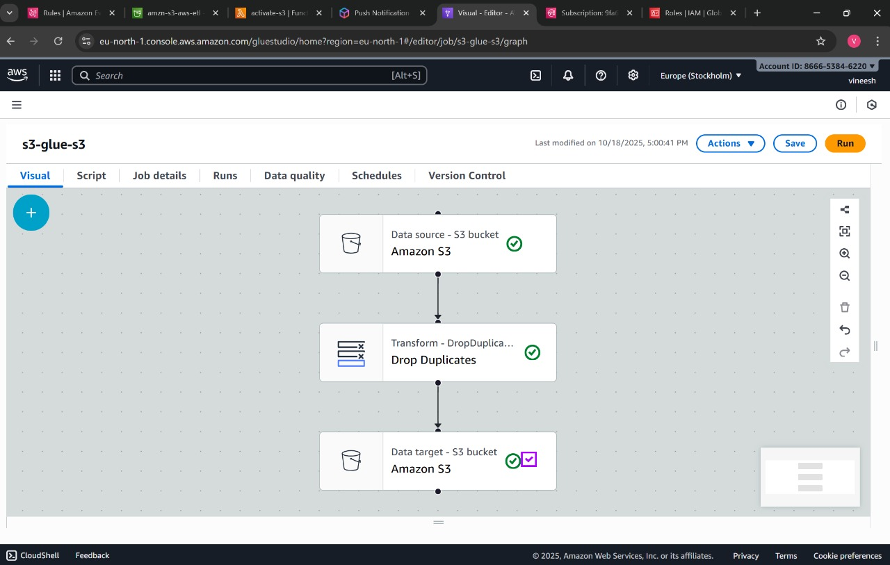

# 🚀 Automated ETL Pipeline using AWS (Python)

This project demonstrates an automated ETL (Extract, Transform, Load) pipeline built using **AWS S3, Lambda, Glue, and CloudWatch**.  
Whenever a file is uploaded to an S3 bucket, a **Python-based Lambda function** triggers a **Glue ETL job** to clean, transform, and reload the data.

## 🧠 Architecture
1. **Amazon S3** → Stores raw data files.
2. **AWS Lambda** → Detects new uploads and triggers Glue.
3. **AWS Glue** → Cleans and transforms data using Pandas.
4. **Amazon CloudWatch** → Monitors logs and job status.
5. **AWS SNS** *(optional)* → Sends notifications on job completion.

## 🧰 Tech Stack
- Python (boto3, pandas)
- AWS Lambda
- AWS Glue
- Amazon S3
- Amazon CloudWatch

## 🧩 How It Works
1. Upload a `.csv` file to the S3 input bucket.
2. Lambda automatically triggers and starts the Glue ETL job.
3. The transformed output is stored back in another S3 folder.
4. CloudWatch logs record all executions.

## 📂 Project Structure
